<style>
section {
  font-family: 'Helvetica Neue', Arial, sans-serif;
  font-size: 22px;
  line-height: 1.4;
  color: #cdd6f4;
  background: #1e1e2e;
}
h1 { color: #89b4fa; font-size: 1.9em; }
h2 { color: #94e2d5; border-bottom: 2px solid #585b70; padding-bottom: 6px; }
h3 { color: #89b4fa; }
strong { color: #fab387; }
em { color: #a6adc8; }
code { background: #313244; padding: 2px 6px; border-radius: 4px; font-size: 0.85em; color: #f5c2e7; }
blockquote { border-left: 4px solid #89b4fa; padding-left: 1em; color: #bac2de; font-style: italic; }
table { font-size: 0.85em; color: #cdd6f4; }
th { background: #313244; color: #cdd6f4; }
td { background: #181825; }
.columns { display: grid; grid-template-columns: 1fr 1fr; gap: 1.5em; align-items: start; }
.three { display: grid; grid-template-columns: 1fr 1fr 1fr; gap: 1em; }
.small { font-size: 0.75em; }
.references { font-size: 0.55em; line-height: 1.3; }
.references li { margin-bottom: 0.3em; }
section header { color: #6c7086; }
section footer { color: #6c7086; }
</style>

<!-- _paginate: false -->
<!-- _header: '' -->
<!-- _footer: '' -->

<style scoped>
section {
  display: flex;
  flex-direction: column;
  justify-content: center;
  align-items: flex-start;
  padding: 0 5%;
}
.eyebrow { color: #94e2d5; font-size: 0.7em; letter-spacing: 0.2em; text-transform: uppercase; margin-bottom: 0.4em; }
h1 { color: #cdd6f4 !important; font-size: 3.2em; line-height: 1.1; margin: 0 0 0.05em 0; }
h1 em { color: #89b4fa; font-style: normal; font-weight: 400; font-size: 0.6em; display: block; margin-top: 0.15em; }
.tag { color: #fab387; font-size: 1.1em; margin-top: 0.4em; }
.lede { color: #bac2de; font-size: 1.1em; margin-top: 0.8em; max-width: 70%; }
.author { color: #6c7086; font-size: 0.7em; margin-top: 2.5em; letter-spacing: 0.05em; }
</style>

<span class="eyebrow">Harness Engineering · 2026</span>

# Arreios Digitais
# *Autoadaptativos*</h1>

<span class="tag">Um assistente que aprende com você</span>

<p class="lede">O Hermes, suas skills, e como o harness de um agente virou a alavanca mais importante da engenharia de IA.</p>

<span class="author">Ney Lemke · CIO UNESP · CTInf · 2026</span>

---

# O que um LLM cru não faz

Um modelo de linguagem treinado **não é um agente**. Ele:

1. **Esquece tudo** entre conversas — começa do zero a cada prompt
2. **Não vê seus arquivos** — não tem filesystem, não tem contexto de projeto
3. **Não executa ações** — não roda comandos, não lê e-mail, não agenda reunião
4. **Alucina com confiança** — inventa paths, APIs, fatos, clientes
5. **Não aprende com erros** — amanhã repete o mesmo bug de hoje

> Sem ajuda externa, o LLM é um autocomplete glorificado.

---

# LLMs → Harness: a virada

De usar LLM **como ferramenta** a construir LLM **como agente** num sistema que orquestra.

| Antes (v1) | Agora (v2) |
|---|---|
| Skills isoladas por ferramenta | **Skill libraries** com padronização `agentskills.io` |
| Gateway Telegram único | **Gateway multiplex** servindo 6+ canais (Telegram, Slack, Discord, WhatsApp, Signal, CLI) |
| "Faz o prompt direito" | **Harness Engineering** virou a 4ª paradigma da engenharia de IA |
| Autoedição ad-hoc | **Ratchet pattern**: cada falha vira nova regra versionada |
| 1 agente por tarefa | **Sub-agentes, planejamento recursivo, loops Ralph** |

> De **"como eu ensino o modelo"** → **"como eu projeto o sistema ao redor do modelo"**.

---

# Os 5 ingredientes que transformam LLM em agente

Para cada limite, um ingrediente resolve:

| Limite do LLM | Ingrediente que resolve |
|---|---|
| Esquece entre conversas | **Memória persistente** em camadas (3 tiers) |
| Não vê seus arquivos | **Ferramentas** — terminal, browser, MCP, file edit |
| Não executa ações | **Skills** — procedimentos reutilizáveis versionados |
| Alucina com confiança | **Contexto** estruturado (AGENTS.md, contexto da tarefa) |
| Não aprende com erros | **Eval loop** — cada falha vira teste, depois regra |

> Quando esses 5 ingredientes se compõem, o LLM deixa de ser autocomplete e vira ferramenta.

---

# Da combinação nasce o harness

LLM sozinho = autocomplete.
LLM + 5 ingredientes = ferramenta útil.
**LLM + 5 ingredientes + orquestração contínua = agente.**

Esse sistema ao redor do modelo é o **harness**. E em 2026, a engenharia de harness virou a alavanca mais importante da IA — 6× mais impacto que trocar o modelo, segundo Stanford/Tsinghua.

> A pergunta deixou de ser *"qual modelo usar"* e virou *"como projetar o sistema que envolve o modelo"*.

---

# O meu dia a dia exige mais que um LLM

Sou CIO da UNESP, professor, pesquisador. Minhas demandas misturam domínios que **um único LLM nu não dá conta**:

| Domínio | Exemplo real | Por que o LLM sozinho não basta |
|---------|--------------|-------------------------------|
| **Programação** | PRs em Rust, debug de drivers, code review | Precisa ler arquivos, rodar testes, abrir PR |
| **Burocracia** | Ofícios à RNP, editais de licitação, convênios | Precisa de templates, prazos, contexto institucional |
| **Física/Matemática** | Simulações, equações, papers, notas de aula | Precisa de LaTeX, plots, bibliografia |
| **Bioinformática** | Pipelines de sequenciamento, BLAST, phylogenia | Precisa de datasets reais e ferramentas específicas |
| **Gestão/CTInf** | Atas, escalas, chamados, planejamento | Precisa de Notion, calendário, mensagens |
| **Sysadmin** | Diagnóstico de crash, drivers NVIDIA, network | Precisa de terminal, journald, ssh |
| **Vida financeira** | Imposto de renda, investimentos, orçamento pessoal | Precisa de planilhas, regras fiscais atualizadas, contexto familiar |
| **Cultura** | Notas sobre cinema, livros, design | Precisa de contexto do meu gosto pessoal |
| **Bots/agentes** | Bot Telegram, perfis de agentes | Precisa de long-running processes |

> Cada linha dessa tabela tem **contexto proprietário, ferramentas específicas, e regras que mudam com o tempo**. Um único prompt não carrega tudo isso.

---

# Parte 1 — Contexto introdutório

Como chegamos aqui? A IA em 2026 vive quatro ondas simultâneas.

---

# As quatro paradigmas da engenharia de IA

| # | Paradigma | Foco | Quando |
|---|-----------|------|--------|
| 1 | **Prompt Engineering** | Como falar com o modelo | 2022–2023 |
| 2 | **Context Engineering** | O que o modelo vê em cada chamada | 2024 |
| 3 | **Agent Engineering** | Tools, planning, memory, action | 2024–2025 |
| 4 | **Harness Engineering** | O sistema **inteiro** ao redor do modelo | **2026 →** |

> "Agent = Model + Harness" — Viv Trivedy, 2026

> "Harness engineering is the discipline of building the runtime control system around an AI agent." — aibuilderclub.com

---

# Por que importou agora?

- **Anthropic** publicou "Effective harnesses for long-running agents" (jan/2026)
- **OpenAI** escreveu "Harness engineering: leveraging Codex in an agent-first world" (fev/2026) — milionário de linhas de código sem humanos digitando
- **Birgitta Böckeler** (Thoughtworks) consolidou em martinfowler.com (fev/2026)
- **Addy Osmani** (Google) publicou "Agent Harness Engineering" (mai/2026)
- **Stanford/Tsinghua**: 6× de diferença de performance **só pelo harness**, mesmo modelo

> O campo está se institucionalizando em meses, não anos.

---

# O que é "harness" exatamente?

> **Harness** = o sistema que circunda o modelo e decide **como ele pensa, planeja, age, percebe contexto, armazena artefatos e se autocorrige**.

Componentes canônicos (Lilian Weng, jul/2026):

| Componente | Responsabilidade |
|------------|-----------------|
| **Context files** (`AGENTS.md`, `CLAUDE.md`) | "README para agentes" — convenções, comandos, regras |
| **Skills** | Prompts + tools + docs invocáveis sob demanda |
| **Tools/MCP** | Interface padronizada com mundo externo |
| **Sub-agents** | Divisão de tarefas longas em paralelas |
| **Hooks** | Ganchos de validação (pre/post tool use) |
| **Memory/Playbooks** | Contexto como **playbook** que evolui (ACE, MCE) |
| **Eval loop** | Verificação automática de qualidade |
| **Sandbox + Permissions** | Limites do que o agente pode fazer |

---

# A virada: o modelo virou commodity

**2018–2024**: melhorar o modelo → melhorar tudo.
**2026**: melhorar o **harness** → melhorar tudo.

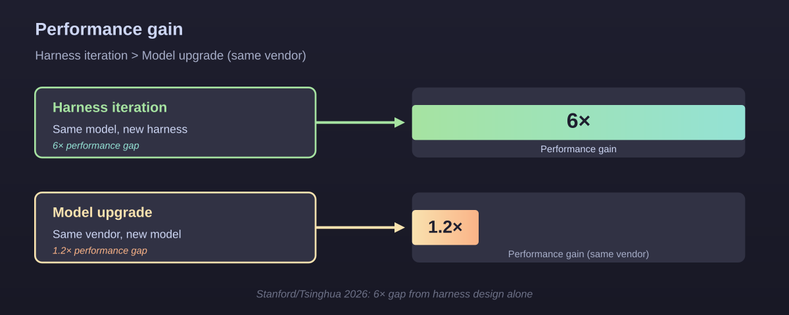

> "The decisive engineering lever has permanently shifted from the model to the system built around it." — masood et al., TechTimes 2026

---

# O padrão "ratchet"

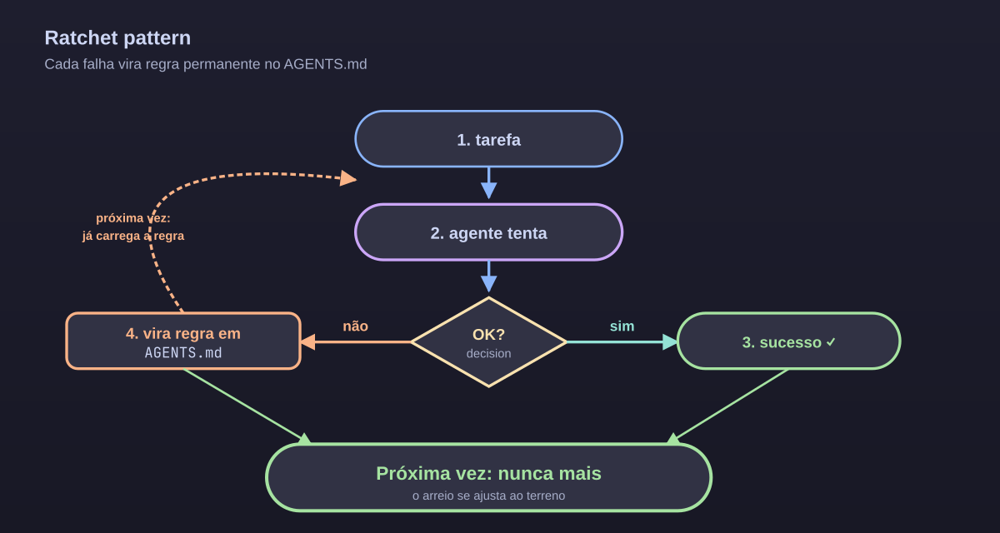

> "Every failure becomes a new rule." — Böckeler, martinfowler.com

É a **alavanca de alavancagem**: cada erro vira uma entrada permanente do playbook. O arreio **se ajusta** ao terreno depois de cada tropeço.

---

# Caso OpenAI/Codex — 1M de linhas, zero humanas

Ryan Lopopolo, OpenAI (fev/2026):

- **5 meses** construindo um produto com 1M linhas
- **0 linhas escritas por humanos** (constraint deliberada)
- **3 engenheiros** mantendo **3,5 PRs/dia cada** (subiu para 7 com mesmo ritmo)
- **1500 PRs** mergeados
- **1/10 do tempo** comparado a escrita manual

> O trabalho humano migrou de "escrever código" para "projetar o ambiente onde o agente escreve código".

---

# Os 3 loops que importam

Dois padrões de autoaprimoramento dominam 2026:

| Loop | Quem usa | Como |
|------|----------|------|
| **ACE** (Agentic Context Engineering) | Anthropic, muitos | Generator → Reflector → Curator mantêm um playbook vivo |
| **MCE** (Meta Context Engineering) | Frontier labs | Cruza skills via **crossover** tipo algoritmo genético |

> Hermes usa algo próximo do ACE nas skills: cada falha evolui uma `SKILL.md` em PR.

---

<!-- _paginate: false -->


# Parte 2 — Hermes: o arreio concreto

De teoria para a implementação que roda no seu laptop.

---

# O que é o Hermes em 2026?

- **Agente open source MIT** (Nous Research), **v0.10 → v0.13** (Tenacity Release)
- 70+ ferramentas built-in, 118 skills bundled
- **6 canais de messaging** num único gateway
- Compatível com `agentskills.io` (padrão aberto)
- **Modelo-agnóstico**: Anthropic, OpenAI, OpenRouter, local (Ollama)

> Lançado em fev/2026, é hoje o stack open-source de agentes que mais cresce.

---

# Arquitetura: três camadas

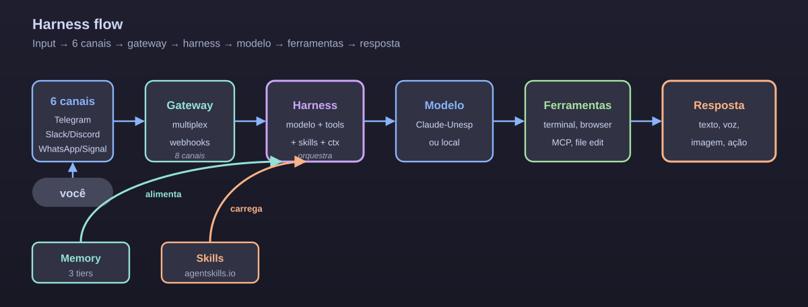

> **6 canais de entrada** convergem no **gateway multiplex** → **harness** orquestra o **modelo** e as **ferramentas**. **Memory** (3 tiers) e **skills** (`agentskills.io`) fecham o loop de feedback.

---

# O Hermes É um harness de harness

A stack do Hermes implementa os 8 componentes canônicos:

| Componente canônico | Implementação Hermes |
|---------------------|----------------------|
| Context files | `~/.hermes/AGENTS.md`, `SOUL.md`, profile-level |
| Skills | `~/.hermes/profiles/<p>/skills/**/SKILL.md` (formato `agentskills.io`) |
| Tools/MCP | Tool Gateway + MCP catalog (Telegram, Discord, **+15**) |
| Sub-agents | `delegate_task` + perfis isolados |
| Hooks | Webhooks + `pre/post` actions no config |
| Memory/Playbook | 3-tier: core, session_search, providers externos |
| Eval loop | `requesting-code-review` skill + GEPA |
| Sandbox/Perms | `TELEGRAM_ALLOWED_USERS`, profile isolation |

---

# Skills: memória procedimental versionada

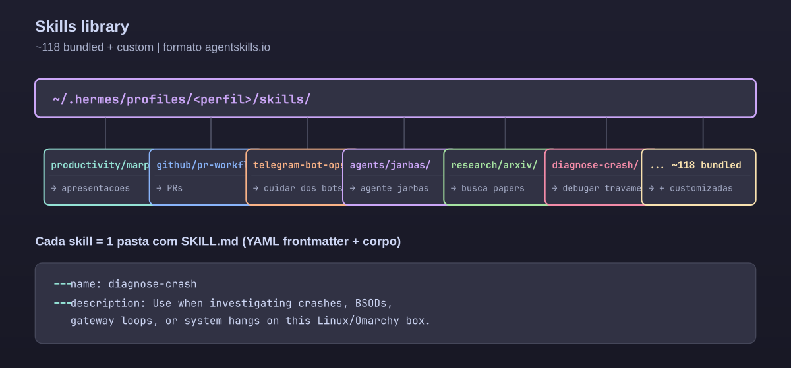

- Frontmatter YAML + corpo Markdown
- **Progressive disclosure**: só carrega quando relevante
- **Auto-geração**: ≥5 tool calls → Hermes pausa, reflete, escreve skill

---

# Memória em 3 tiers

| Tier | Onde | O que guarda | Latência |
|------|------|--------------|----------|
| **1 — Core** | `MEMORY.md` + `USER.md` (~3.5k chars) | Identidade, preferências, environment facts | Sempre no contexto |
| **2 — Session** | SQLite FTS5 pesquisável | Todas as conversas passadas | Sob demanda, rápido |
| **3 — Externo** | Notion, Obsidian, MongoDB, QDrant, Redis | Conhecimento profundo, multi-tenant | Integração |

> Fatos críticos no Tier 1. Detalhes sob demanda nos demais. **Memória profunda é opt-in, não default.**

---

# Gateway multiplex — 6 canais, 1 processo

<style scoped>
section pre { background: #181825 !important; border: 1px solid #45475a; padding: 0.4em 0.6em; border-radius: 6px; }
section pre code { background: transparent !important; color: #f5c2e7 !important; font-size: 0.8em; }
section table { font-size: 0.7em; }
</style>

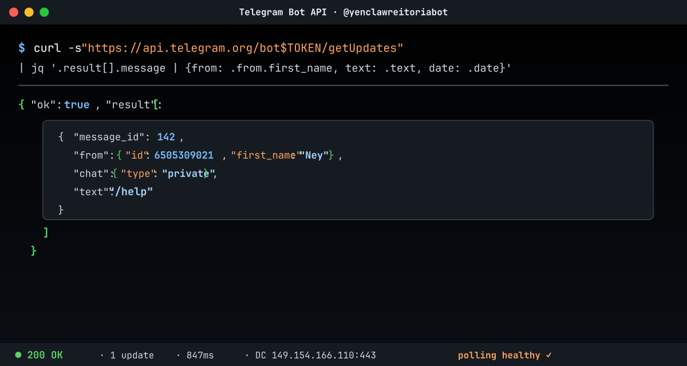

**Antes (v1):** um gateway por perfil → conflitos de PID, port collision.
**Agora (v2):** um único gateway serve **todos os perfis** (linus, montaigne, default…).

```bash
hermes gateway migrate --multiplex
```

<div class="columns">
<div>

| Canal | Status |
|-------|--------|
| Telegram | ✅ produção |
| CLI/TUI | ✅ local |
| Slack | ✅ |

</div>
<div>

| Canal | Status |
|-------|--------|
| Discord | ✅ |
| WhatsApp / Signal | ✅ |
| Email (IMAP/SMTP) | ✅ |

</div>
</div>

---

# Perfis = agentes isolados

<style scoped>
section pre { background: #181825 !important; border: 1px solid #45475a; padding: 0.4em 0.6em; border-radius: 6px; }
section pre code { background: transparent !important; color: #f5c2e7 !important; font-size: 0.8em; }
</style>

```bash
hermes profile create klimt --clone default
hermes profile create linus --clone default
hermes profile create vargani --clone default
```

Cada perfil tem:

- `SOUL.md` próprio (identidade)
- Memória independente
- Bot Telegram dedicado
- Cronjobs separados
- Skills customizadas

---

# Perfis que rodam hoje

Na minha máquina, **5 perfis ativos** que separam domínios do trabalho:

| Perfil | Papel | Exemplo de uso |
|--------|-------|---------------|
| `montaigne` | Bots e voz | Bot Telegram, transcrição de áudio (o que usamos agora) |
| `linus` | Sysadmin | Diagnóstico de crash, drivers, journald |
| `vargani` | Gestão UNESP/CTInf | Atas, escalas, planejamento institucional |
| `ideker` | Bioinformática | Pipelines de sequenciamento, BLAST |
| `klimt` | Cultura | Notas sobre cinema, livros, design |

> Cada perfil é um **sub-agente especializado** com identidade, memória e bot próprio — o mesmo modelo LLM responde a todos, mas com contexto e skills diferentes.

---

# Voz: real-time, nativa

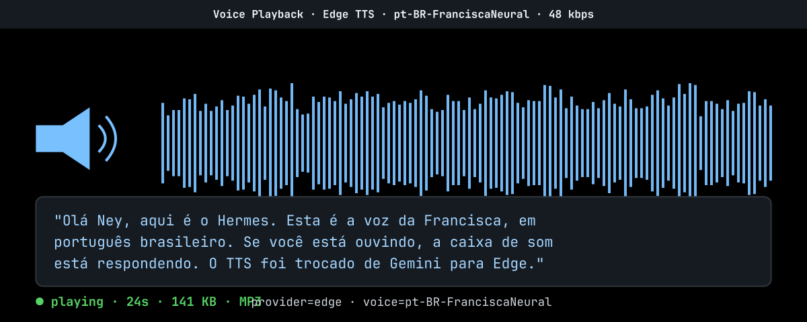

**Herald Release (2026.2):**

- **Voz conversacional em tempo real**
- Edge TTS como default (pt-BR nativo, zero config)
- STT local via `faster-whisper` (base/small/large-v3)
- Multilingual, switch automático de idioma

---

# Desktop nativo (Surface Release, jun/2026)

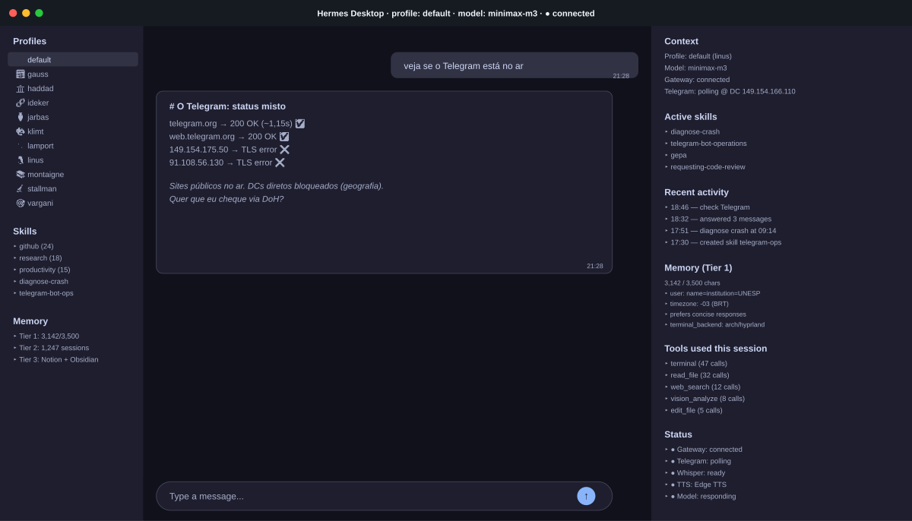

- **App desktop nativo** (Electron) — macOS, Linux, Windows
- Painel web de administração (canais, creds, MCP, webhooks)
- **Sessões multi-perfil concorrentes** em abas
- Arrasta-e-solta arquivos no chat
- Conecta a **gateway remoto** (homelab, hosted) via OAuth
- `/undo` para desfazer últimas N turns
- Modelo picker fuzzy no status bar

---

# Parte 3 — Como o trabalho mudou

O dia-a-dia de usar Hermes em 2026.

---

# Antes vs. depois: o workflow

| Aspecto | Antes (v1) | Agora (v2) |
|---------|-----------|------------|
| Onboarding | 1h explicando contexto | 30s — memória + skills já carregadas |
| Tarefa nova | Tenta, falha, refaz | Tenta → falha → **escreve skill** → próximo: resolve na 1ª |
| Reuniões | Anota e processa depois | Teams bot pipeline: transcrição → skill `meeting-action-items` → cards no Notion |
| Diagnóstico | Você debug | `diagnose-crash` skill: journald + dmesg + last + logs → relatório com causa raiz |
| Apresentação | Slide por slide | `marp` skill: estrutura → conteúdo → render → push |
| PR review | Manual ou amigo | `requesting-code-review` skill: security + quality gates + auto-fix |
| Knowledge mgmt | Wiki parada | GEPA evolui skills offline baseado em traces |

---

# Caso real: pipeline de reuniões Teams

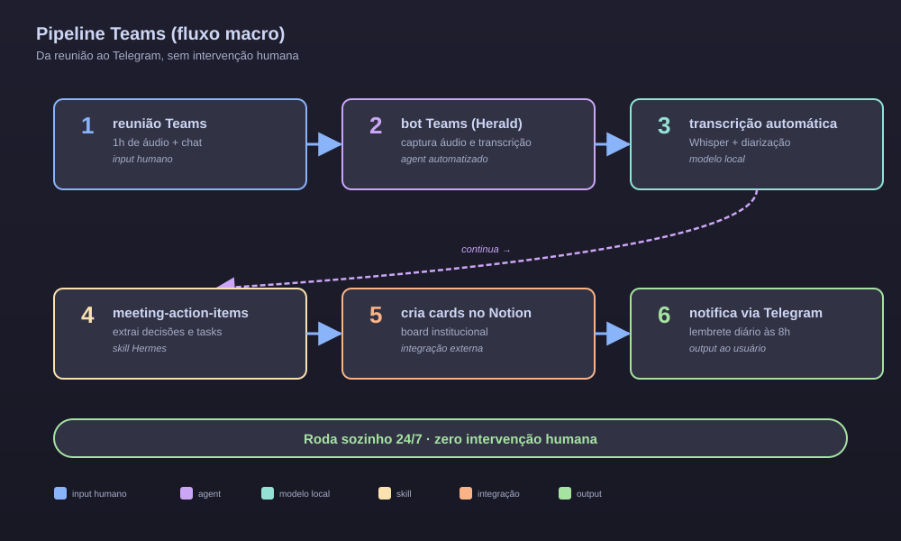

> **Roda sozinho 24/7, zero intervenção.**

---

# Pipeline Teams: por dentro

**Inputs (Teams bot)**
- Áudio da reunião via Herald
- Transcrição com diarização
- Timestamps e participantes

**Processamento**

- Skill `meeting-action-items` extrai:
  - Decisões com contexto
  - Action items com **owner + due date** inferido
- LLM faz o mapeamento com base no histórico do Tier 2

**Outputs (3 destinos paralelos)**
- Cards no Notion (board institucional)
- Mensagem no Telegram (lembrete diário)
- Cron 8h: resumo do que está aberto

---

# Caso real: o crash de hoje cedo

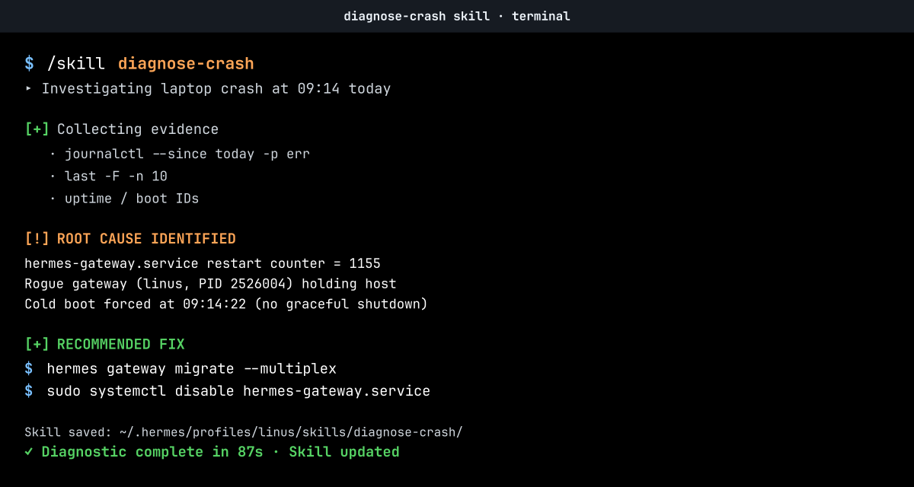

> O laptop caiu às 9:14 com `hermes-gateway.service` em loop infinito (counter 1155+).

Com a skill `diagnose-crash`, o diagnóstico foi:

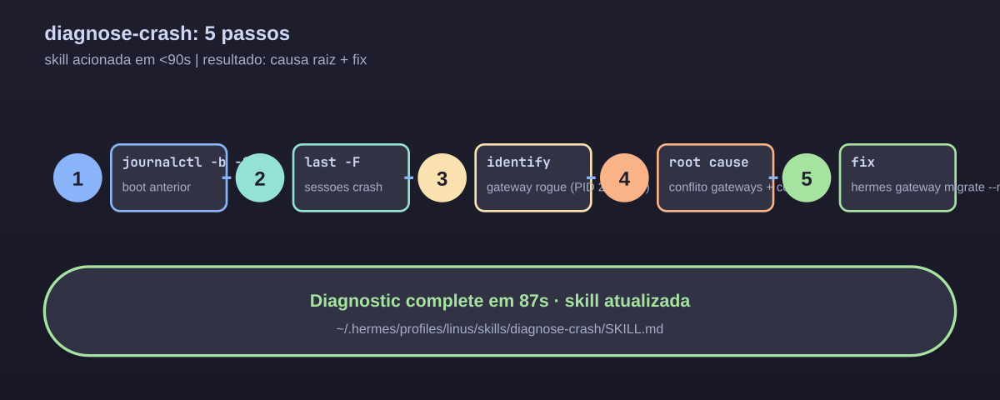

> **Antes**: 30 min fuçando logs no escuro. **Agora**: skill resolve em 90 segundos.

---

# Caso real: skill auto-gerada ontem

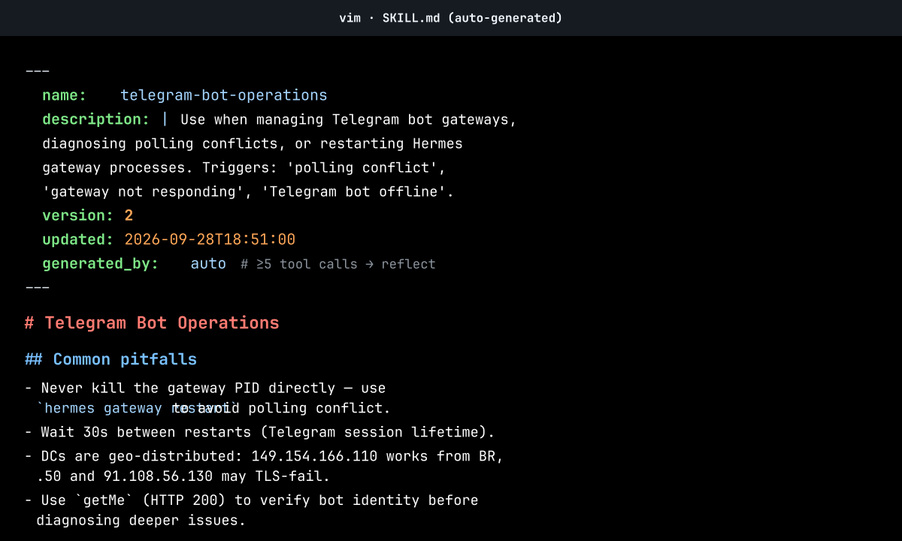

O usuário pediu para "verificar se o Telegram está no ar". Em menos de 10 trocas, o Hermes:

1. Tentou `curl` nos DCs públicos → falhou
2. Detectou que IPs individuais falham mas `149.154.166.110` responde
3. Escreveu nota sobre a geolocalização dos DCs do Telegram
4. Propôs criar/atualizar skill `telegram-bot-operations`
5. Em 5 minutos: skill atualizada e testada

> **Autoedição em tempo real** — o arreio **se ajusta durante a montaria**.

---

# O loop de melhoria contínua (atualizado)

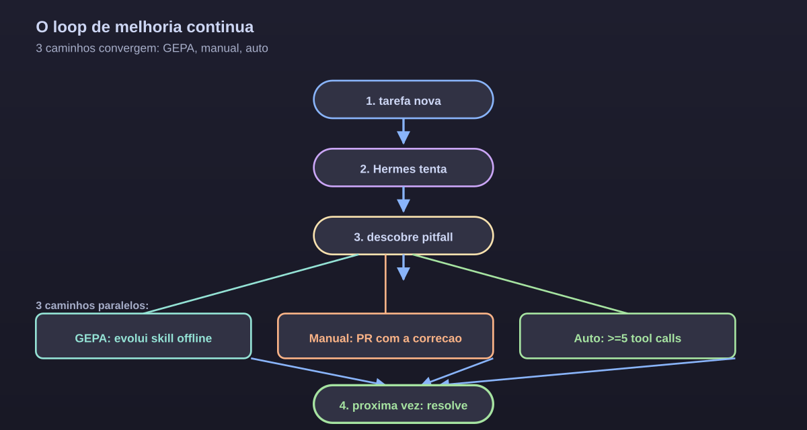

> Três caminhos convergem: **o arreio nunca mais erra isso**.

---

# GEPA: evolução genética de prompts

> *Genetic-Pareto Prompt Evolution* — paper ICLR 2026

1. Lê a skill atual
2. Gera dataset de execuções reais (traces)
3. Roda o otimizador GEPA (custo ~$2–10, **sem GPU**)
4. Avalia candidatos em Pareto front
5. Aplica constraints (segurança, estilo)
6. Abre PR com a melhor variante

> Skills **melhoram sozinhas** em background. O arreio fica mais justo a cada passada.

---

# Comparativo: por que não só ChatGPT?

| Critério | ChatGPT | Codex CLI | Hermes v2 |
|----------|---------|-----------|-----------|
| Harness engineering completo | ❌ | parcial | ✅ (8/8 componentes) |
| Memória persistente multi-tier | ❌ | ❌ | ✅ 3 tiers |
| Skills customizadas versionadas | ❌ | via filesystem | ✅ `agentskills.io` |
| Auto-geração de skills | ❌ | ❌ | ✅ ≥5 tool calls |
| 6+ canais de messaging | ❌ | ❌ | ✅ |
| Modelo-agnóstico | ❌ | ❌ | ✅ |
| Provedor próprio (UNESP) | ❌ | ❌ | ✅ `llm.tools.unesp.br` |
| Privacidade (local-first) | ❌ | parcial | ✅ modelo local possível |
| Open source MIT | ❌ | ❌ | ✅ |
| Evolução offline (GEPA) | ❌ | ❌ | ✅ |

---

# Integração com a UNESP

- **Claude-Unesp**: `llm.tools.unesp.br` (dados não saem)
- **Notion**: gestão de tarefas institucionais via `notion` skill
- **Google Workspace**: `gws` CLI (Gmail, Calendar, Drive)
- **GitHub**: PRs, issues, code review via `github` skill
- **Teams**: pipeline de reuniões → action items → Notion
- **AgentMail**: e-mails automáticos com triagem inteligente
- **REDNESP / C3SP**: HPC assistido por IA (em rollout)

---

# Omarchy: o SO controlado por agentes

Omarchy (Arch Linux baseado) é o **laboratório vivo** do Hermes — cada componente do sistema é uma skill, e cada skill vira um comando que a IA pode invocar.

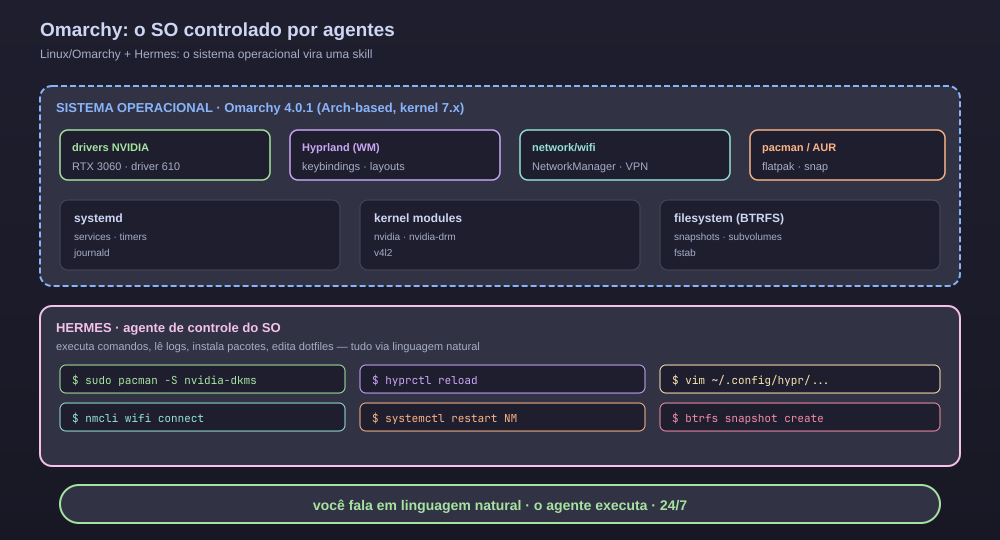

**Exemplos reais** do que o agente faz no SO:

| Pedido em linguagem natural | O que o agente executa |
|----------------------------|-----------------------|
| "instale CUDA" | `sudo pacman -S cuda nvidia-dkms` + valida driver |
| "minha wifi caiu" | `journalctl -u NetworkManager` + diagnóstico + reconecta |
| "troque a tecla SUPER+T" | edita `~/.config/hypr/hyprland.conf` + `hyprctl reload` |
| "antes desse update, faz snapshot" | `btrfs snapshot create` + confirma |
| "debug do driver NVIDIA" | `nvidia-smi` + journald + skill `diagnose-crash` |

> O SO vira **manipulável por conversa**. Cada dotfile, serviço e pacote é uma tool que o agente conhece — e cada erro vira uma nova regra persistida em `AGENTS.md`.

---

# Cadeia 100% software livre

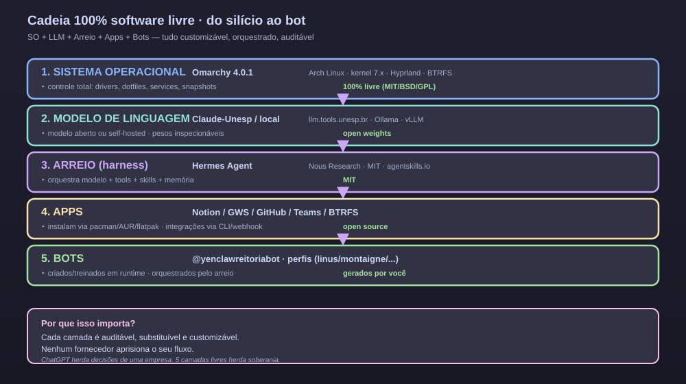

---

# Onde estamos vs. fronteira

| Capacidade | Estado hoje | Fronteira 2026 |
|------------|-------------|----------------|
| Skills estáticas | ✅ 118 bundled | meta-skills auto-crossing (MCE) |
| Memória multi-tier | ✅ 3 tiers | playbooks evolutivos (ACE) |
| Gateway multiplex | ✅ produção | agentes em rede via A2A |
| Voz conversacional | ✅ real-time | prosódia emocional, dialetos |
| Auto-aprimoramento | ✅ manual+GEPA | harness que evolui sozinho (AHE) |
| Multi-tenant | parcial | per-tenant context studios |

> Hermes está **no mainline** da fronteira open-source — não atrás dela.

---

# O que vem por aí (próximos 6-12 meses)

- **Ralph Loops** no Hermes: agentes rodam até PR mergeado, sem humano no loop
- **A2A inter-profile**: bots conversando entre si (linus ↔ vargani)
- **AHE** (Agentic Harness Engineering): observabilidade que evolui o harness automaticamente
- **RAG semântico** sobre wiki UNESP com embeddings locais
- **Agentes verticais**: bioinfo (ideker), pedagogy (klimt), procurement (vargani)
- **HaaS** (Harness-as-a-Service): hospedar o harness de terceiros

---

<!-- _paginate: false -->
<!-- _backgroundColor: #11111b -->
<!-- _color: #cdd6f4 -->
<!-- _header: '' -->
<!-- _footer: '' -->

# Arreios bem ajustados

## não prendem — **liberam**

### Eles **evoluem** enquanto você trabalha

---

<!-- _paginate: false -->

# Em uma frase

> O Hermes não é mais um assistente de IA.
> É um **harness completo** que **se autoaperfeiçoa** —
> e que entende quem você é, o que você faz, e como você fala.

---

# Perguntas?

**Ney Lemke**
CIO · UNESP · CTInf
ney.lemke@unesp.br

---

# Referências (selecionadas)

<ul class="references">
<li>OpenAI. "Harness engineering: leveraging Codex in an agent-first world." fev/2026. openai.com/index/harness-engineering/</li>
<li>Anthropic. "Effective harnesses for long-running agents." jan/2026.</li>
<li>Böckeler, B. "Harness engineering." martinfowler.com. fev/2026.</li>
<li>Osmani, A. "Agent Harness Engineering." O'Reilly Radar. mai/2026.</li>
<li>Weng, L. "Harness Engineering for Self-Improvement." Lil'Log. jul/2026. lilianweng.github.io/posts/2026-07-04-harness/</li>
<li>Masood et al. "'Harness Engineering' Emerges as the Fourth Paradigm of AI Engineering." TechTimes. mai/2026.</li>
<li>Manchikanti, K. "How 60 production agents actually self-improve." LinkedIn. 2026.</li>
<li>Ning et al. "Harness Engineering for Agentic AI Coding Tools." arXiv:2602.14690. 2026.</li>
<li>LangChain. "The Anatomy of an Agent Harness." mar/2026.</li>
<li>Addy Osmani / OpenAI. "Harness engineering: leveraging Codex in an agent-first world." 2026.</li>
<li>Nous Research. Hermes Agent v0.10 (abr/2026) → v0.13 Tenacity (mai/2026) → v0.21 (atual).</li>
<li>Zhang et al. "Agentic Context Engineering (ACE)." 2025.</li>
<li>Ye et al. "Meta Context Engineering (MCE)." 2026.</li>
<li>Lin et al. "Agentic Harness Engineering: Observability-Driven Automatic Evolution of Coding-Agent Harnesses." arXiv:2604.25850. 2026.</li>
<li>Hermes Agent docs. hermes-agent.nousresearch.com/docs</li>
</ul>
